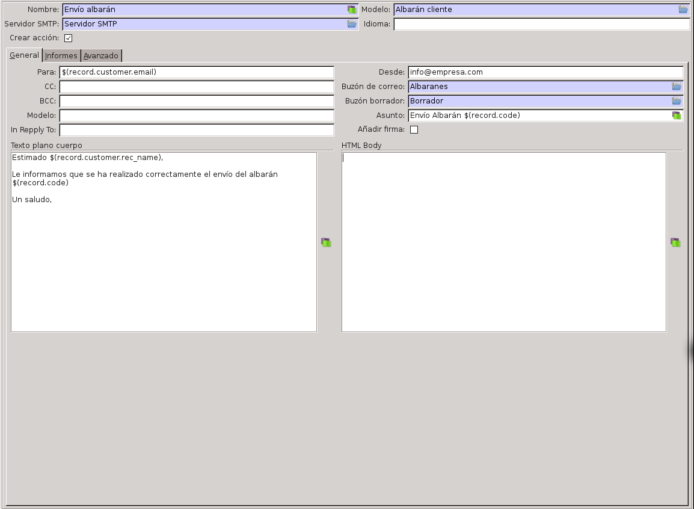

#:inside:electronic_mail/electronic_mail:section:configuracion#

Además de llevar a cabo el procedimiento anterior, debemos tener 
configurado como mínimo un servidor SMTP para que se realicen los envíos 
correctamente. Para configurar un servidor SMTP debemos ir a la opción 
*Administración* > *SMTP* > *Servidores*.

Allí deberemos introducir un nombre y los datos de conexión al servidor SMTP. 
Por favor, contacte con su administrador del correo electrónico en caso de 
desconocer los datos. 

Una vez introducida esta información podemos verificar que la conexión se 
realiza correctamente utilizando el botón *Test conexión*.

Si marcamos el campo *Por defecto*, este servidor se utilizará para todos los 
envíos en los que no se haya forzado ningún envío.

Si queremos forzar que todos los correos desde la dirección de correo 
introducida en el campo *Correo electrónico* debemos marcar la opción *Usar 
email*.

#:after:electronic_mail/electronic_mail:section:mailbox#

====================
Plantillas de correo
====================

Las plantillas de correo electrónico nos permiten crear una acción para enviar 
un correo electrónico a partir de los registros de algún modelo. Además también 
podemos asociarlas con un disparador para que el sistema envíe automáticamente 
un correo electrónico cuando se dé el disparador. Por ejemplo, esto nos puede 
ser útil para enviar un correo electrónico al cliente cuando se realice el 
envío de uno de sus albaranes. 

.. inheritref:: electronic_mail_template/electronic_mail:section:plantillas

Plantillas
==========

En Tryton podemos crear plantillas de correo electrónico que permitan enviar 
mensajes predefinidos de forma manual desde una pantalla en concreto (por 
ejemplo, desde facturas o pedidos), así como automatizar totalmente el envío 
(por ejemplo, mandar la factura por correo electrónico cuando se confirme el 
documento de factura). Para los tags se usan expresiones Genshi_ 
(**recomendable**), Jinja2_ (si se encuentra instalado) o Python. Consulte el 
apartado plantillas para ver ejemplos. 

.. _Genshi: http://genshi.edgewall.org/wiki/Documentation/0.4.x/text-templates.html

.. _Jinja2: http://jinja.pocoo.org/docs/

Como podemos observar hemos utilizado las expresiones $(record.nombre_campo) 
para indicar que queremos reemplazar estas expresiones por los valores del 
registro desde el que estamos creando el correo electrónico. 

Además, como hemos marcado la opción *Crear acción*, en el menú de albaranes de 
clientes tendremos disponible una nueva acción llamada *Envío albarán*, que 
podremos utilizar para enviar esta plantilla al cliente.

.. Si clicamos en esta opción se generará la siguiente pantalla:
   Imagen pantalla enviar correo

Podremos observar como nos modifica las expresiones con los valores del 
registro seleccionado. En caso de querer personalizar el texto podemos 
modificar los campos antes de realizar el envío.
   
   
.. inheritref:: electronic_mail_template/electronic_mail:section:envio

Envío
=====

.. inheritref:: electronic_mail_template/electronic_mail:section:disparadores

Disparadores
------------

En las plantillas deberá especificar los disparadores para que se envie el
correo electrònico. Puede añadir a la plantilla varios disparadores con sus
condiciones.

El correo electrónico sólo se enviará en caso que la condición del disparador
sea cierta. Se puede utilizar la palabra clave `self` para hacer referencia
al registro actual.

Los disparadores se pueden evaluar en alguna de las siguientes condiciones:

    - *Al momento*: Se comprobará cada 5 minutos si algún registro del modelo
      cumple con la condición dada.
    - *Al crear*: Se comprovará la condición para cada registro que se cree.
    - *Al modificar*: Se comprobara que el registro no cumpla la condición
      antes de modificar y si lo cumpla despues de la modificación del mismo.
      De esa forma solo se obtendran los registros en que los canvios haya
      provocado que la condición cambie de Falso a Verdadero.
    - *Al eliminar*: Se evaluará la condición antes de eliminar los registros.

.. note:: Si se marca la opción *Al momento* no se podrá marcar ninguna de las
    otras condiciones y viceversa.

Ejemplos
~~~~~~~~

Se quiere enviar la plantilla cada vez que se cree un nuevo registro del modelo::

    Crearemos un disparador marcando la opción `Al crear` y pondremos como
    condicion `True`.

Se quiere enviar la plantilla cada vez que se elimine un registro del modelo::

    Crearemos un disparador marcando la opción `Al eliminar` y pondremos como
    condicion `True`.

Se quiere enviar la plantilla cada vez que una venta se passe al estado
`Confirmado`::

    En una plantilla relacionado con el modelo de `Ventas` crearemos un
    disparador marcando la opción `Al modificar` y pondremos como condicion
    `self.state == 'confirmed'`.

Se quiere enviar la plantilla cada vez que se introduzca (creación o
modificación) una factura con importe superior a 10.000::

    En una plantilla relacionado con el modelo de `Facturas` crearemos un
    disparador marcando la opción `Al modificar` y la opción `Al crear`.
    Pondremos cómo condicion `self.total_amount > Decimal('10.000')`.

.. inheritref:: electronic_mail_template/electronic_mail:section:planificador

Planificador
------------

.. important:: Es importante que cambie el usuario del cron de **Run On Time
              Triggers**, que por defecto es **Cron Trigger**, por un usuario
              de tipo **Administrador**. Este usuario, debe tener permisos de
              lectura y escritura de los **Buzones de correo**.

              Puesto que por defecto únicamente se pueden seleccionar usuarios
              desactivados para ejecutar crons, se debe cambiar el código del
              servidor para poder seleccionar usuarios activos.

.. inheritref:: electronic_mail_template/electronic_mail:section:envio_manual

Envío manual
------------

Una vez generado un correo electrónico a partir de una plantilla, se podrá
reenviar cuantas veces quiera. Para ello, basta con acceder a la bandeja de
correos electrónicos, abrir el correo que se desee enviar y hacer clic en el
botón que tiene para tal efecto.

.. important:: Sólo se pueden reenviar los correos electónicos generados a
              partir de plantillas. Para enviar correos electrónicos use los
              asistentes de envío de correo a partir de plantillas. Sólo se
              podrán enviar correos electrónicos que contengan cuerpo de texto
              (contenido).

.. inheritref:: electronic_mail_template/electronic_mail:section:informes

Informes
========

En la plantilla puede seleccionar los informes que se adjuntarán en el correo
electrónico.

Si no se especifica ningún nombre en el informe, el nombre del adjunto vendrá
definido por el nombre del modelo+extensión. Si deseamos personalizar los
nombres de los adjuntos, podemos editar el informe y añadir en el campo
**Nombre del informe** expresiones para personalizar el informe.

Por ejemplo en un pedido de venta podemos personalizar el informe con el nombre:

.. code::

    empresa_pedido_${record.reference or record.sale_date}

.. important:: Si personalizamos el nombre del informe, este no debe contener la
              extensión del fichero. En el momento de enviar el correo, se
              añadirá la extensión según el tipo de fichero (MIMEType). Por
              defecto, los informes son documentos ODT
              (application/vnd.oasis.opendocument.text)

.. inheritref:: electronic_mail_template/electronic_mail:section:firma

Firma
=====

En la plantilla podemos seleccionar la opción **Firma**. Esta opción nos
añadirá la firma del usuario de Tryton en la firma del correo.

.. inheritref:: electronic_mail_template/electronic_mail:section:colas

Colas
=====

Si selecciona la opción de "Colas" el correo no se enviará en el momento de renderizar el correo. Estará
disponible al buzón de salida y se enviará según la configuración de la acción planificada.

Destinatarios
=============

A continuación se muestran algunos ejemplos para añadir en el campo "Destinatarios"
en la plantilla de correo para obtener los correos electrónicos a que se deben enviar:

Correo por defecto del tercero:

.. code::

    ${record.email or ''}
    ${record.get_mechanism('email') or ''}

Todos los correos del tercero:

.. code::

    ${','.join([x.email for x in record.party.contact_mechanisms if x.type == 'email']) or ''}

Todos los correos relacionados con las direcciones del tercero:

.. code::

    ${','.join([x.email for x in record.addresses if x.email]) or record.get_mechanism('email') or ''}

Enviar correos a los usuarios que han creado o modificado un registro:

.. code::

    ${record.write_uid and record.write_uid.email or record.create_uid.email}

En el caso que el objeto sea una factura, pedido de venta, la información del correo
estaría dentro del campo "party". Consulte a los campos del modelo para saber que campo
debemos relacionarlo.

.. code::

    ${record.invoice_address.email or record.party.get_mechanism('email') or ''}
